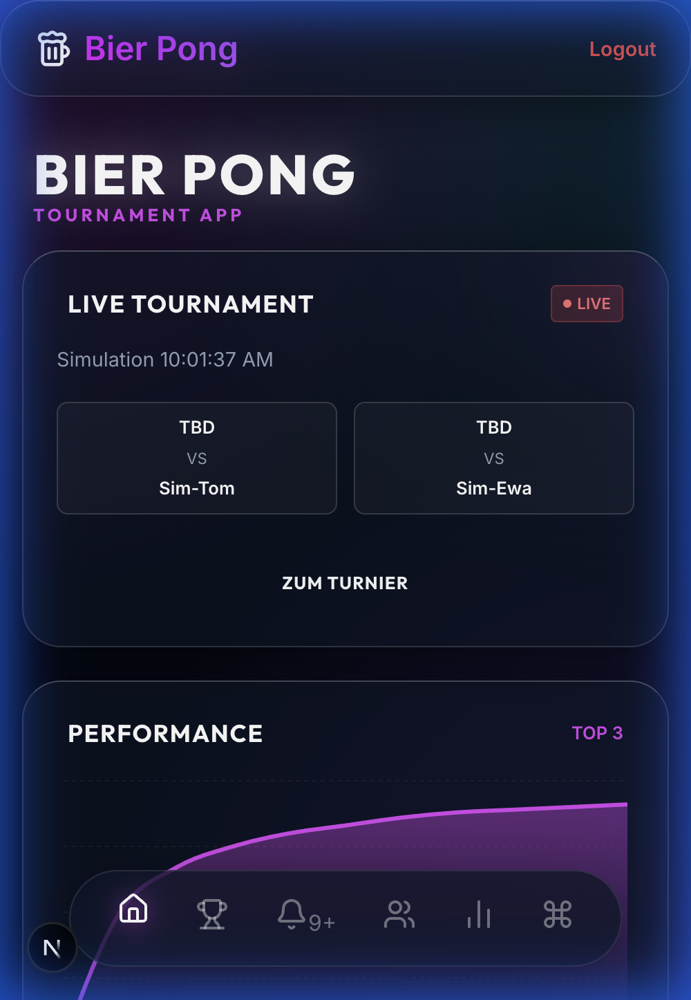
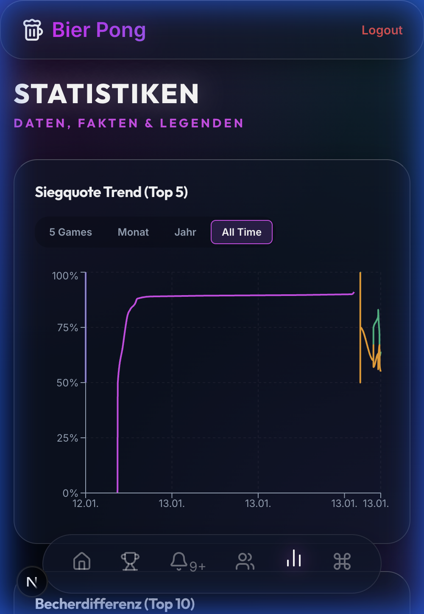
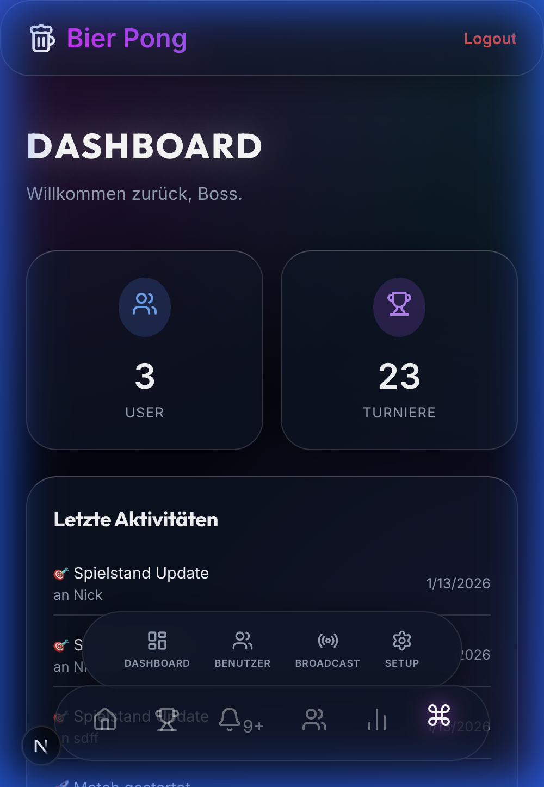
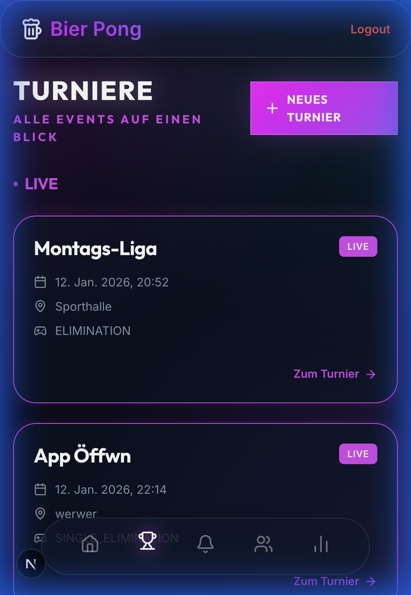
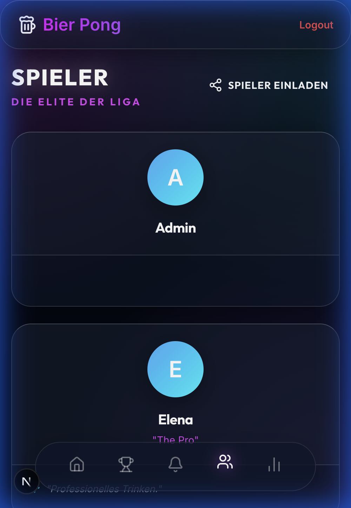
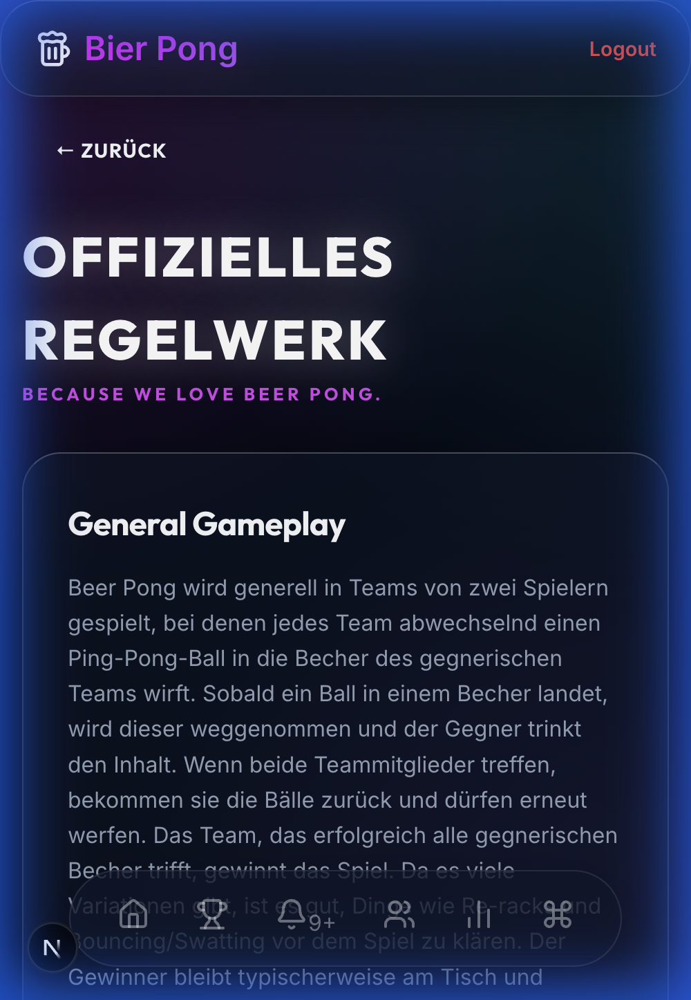

# Beer Pong Tournament Manager 🍺


A premium, modern web application for managing Beer Pong tournaments. Built with Next.js and designed with a "Neon Flow" aesthetic, this app provides real-time tournament tracking, player statistics, and a seamless user experience for your next party.

## 📸 Screenshots

<p align="center">
  
  
  
</p>

<p align="center">
  
  
  
</p>


## 🛠️ Tech Stack

- **Framework**: [Next.js 15](https://nextjs.org/) (App Router)
- **Database**: [SQLite](https://www.sqlite.org/) with [Prisma ORM](https://www.prisma.io/)
- **Styling**: Custom CSS with CSS Variables & Glassmorphism
- **Icons**: [Lucide React](https://lucide.dev/)
- **Authentication**: [NextAuth.js](https://next-auth.js.org/) (configured for local use)

## 🚀 Getting Started

### Prerequisites

- Node.js 18+
- npm, yarn, or pnpm

### Installation

1. **Clone the repository**
   ```bash
   git clone https://github.com/yourusername/beer-pong.git
   cd beer-pong
   ```

2. **Install dependencies**
   ```bash
   npm install
   ```

3. **Setup Database**
   Initialize the SQLite database with Prisma:
   ```bash
   npx prisma migrate deploy
   ```

4. **Run the application**
   ```bash
   npm run dev
   ```

5. **Open in Browser**
   Navigate to [http://localhost:3000](http://localhost:3000)

## 📖 Usage

- **Create a Tournament**: Go to the Admin dashboard/Tournaments to start a new event.
- **Add Players**: Register players to track their stats globally across tournaments.
- **Track Games**: Click on matches to enter results. The bracket updates automatically.

## 📄 License

This project is licensed under the MIT License - see the [LICENSE](LICENSE) file for details.

---

Made by Nick.