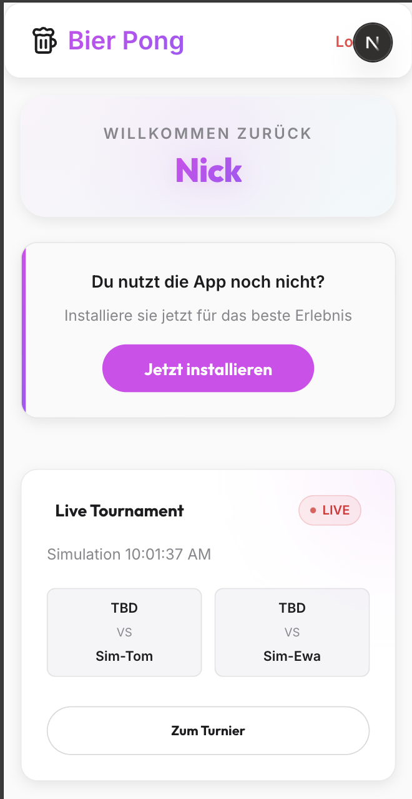

# Bier Pong Tournament Manager


A modern, mobile-first web application for managing Beer Pong tournaments. Built with Next.js 15 and a "Neon Flow" aesthetic — featuring real-time brackets, player statistics, live chat, and full PWA support.

## Quick Setup

**On a fresh server** (installs Node, clones repo, configures nginx + SSL + PM2):
```bash
curl -sL https://raw.githubusercontent.com/your-org/beer-pong/main/setup.sh | bash
```

**If Node is already installed:**
```bash
npx github:your-org/beer-pong
```

**Local development:**
```bash
git clone https://github.com/your-org/beer-pong.git && cd beer-pong
npm run setup
```

---

## Features

### Tournament Management
- **Multiple Formats**: Single Elimination, Double Elimination, Round Robin, Group Stages
- **Match Scoring**: Tap-button cup count (0–10), mobile numeric keypad, Overtime (OT) mode for tiebreakers
- **Live Brackets**: Auto-updating tournament brackets with real-time match generation
- **Bring Lists**: Integrated supply lists with item quantities, synced across all participants
- **Live Ticker**: Real-time event feed for ongoing matches and results
- **Venue Integration**: Google Maps integration for tournament locations

### Social & Community
- **Live Chat**: Global community chat with PWA- and iOS-optimized keyboard layout, polling every 5 seconds

### Player Statistics
- **Profiles**: Win/loss tracking, win rates, full tournament history
- **Charts**: Area, Bar, and Radar charts for performance trends over time
- **Leaderboard**: Global ranking based on Elo or win ratio

### Authentication & Privacy
- **Protected Routes**: Full app locked behind NextAuth.js authentication
- **User Approval Flow**: New users require admin approval before gaining access. Upon approval, the user receives an automatic email notification.
- **Passkey Support**: WebAuthn passkey login in addition to credentials
- **Guest Access**: Managed guest sessions (24h) for fun/unranked tournaments

### PWA
- **Installable**: Works as a native app on iOS and Android
- **Offline Capable**: Core functionality works with limited connectivity
- **Push Notifications**: Alerts for match calls, results, and tournament updates
- **Mobile UI**: Animated bottom nav for logged-in users, floating QR Pill for guests

### Admin Dashboard
- **Player Management**: Approve, reject, or remove players
- **Match Control**: Override scores, manage tournament flow
- **App Settings**: Configure global app behavior
- **Mobile-Optimized**: Full admin access from any device

---

## Tech Stack

| Layer | Technology |
|---|---|
| Framework | [Next.js 15](https://nextjs.org/) (App Router, Server Actions) |
| Language | TypeScript |
| Database | SQLite via [Prisma ORM](https://www.prisma.io/) + `better-sqlite3` |
| Auth | [NextAuth.js 5](https://next-auth.js.org/) (Credentials + Passkey) |
| UI | React 19, Framer Motion, Lucide Icons |
| Charts | [Recharts](https://recharts.org/) |
| Maps | Google Maps Platform |
| Email | [Resend](https://resend.com) |
| Error Tracking | [Sentry](https://sentry.io) |
| Performance | [Lighthouse CI](https://github.com/GoogleChrome/lighthouse-ci) (self-hosted) |

---

## Local Development

```bash
# 1. Clone
git clone https://github.com/yourusername/beer-pong.git
cd beer-pong

# 2. Install dependencies
npm install

# 3. Configure environment
cp .env.example .env
# Fill in AUTH_SECRET, DATABASE_URL, ADMIN_EMAIL, VAPID keys, Google Maps API key

# 4. Initialize database
npx prisma migrate dev

# 5. Start dev server
npm run dev
```

Open [http://localhost:3000](http://localhost:3000).

---

## Deployment

### Vercel

1. Push to a GitHub repository
2. Import in [Vercel](https://vercel.com)
3. Set the following environment variables:

| Variable | Description |
|---|---|
| `DATABASE_URL` | SQLite path or Postgres/MySQL connection string |
| `AUTH_SECRET` | Random secret for NextAuth.js |
| `ADMIN_EMAIL` | Email address that receives admin privileges |
| `NEXT_PUBLIC_VAPID_PUBLIC_KEY` | VAPID public key for push notifications |
| `VAPID_PRIVATE_KEY` | VAPID private key for push notifications |
| `NEXT_PUBLIC_GOOGLE_MAPS_API_KEY` | Google Maps API key |
| `RESEND_API_KEY` | API key for [Resend](https://resend.com) — required for email notifications |
| `APP_URL` | Public base URL of the app (e.g. `https://bier.olomek.com`) — used to build links in emails |

4. Deploy

### Manual / Self-Hosted

```bash
npm run build
npm start
```

---

## Email Notifications

Transactional emails are sent via [Resend](https://resend.com). Requires a verified sending domain in the Resend dashboard.

### Triggered events

| Event | Recipient | Sender |
|---|---|---|
| Account approved by admin | Registered user | `noreply@bier.olomek.com` |

### Setup

1. Create an account at [resend.com](https://resend.com) and add your domain.
2. Generate an API key with **Sending access**.
3. Set the following environment variables:

```
RESEND_API_KEY=re_...
APP_URL=https://your-domain.com
```

Email sending is non-blocking — a failure to deliver an email will not interrupt the admin approval action, but will be logged to the server console.

---

## Maintenance Mode

The app supports a zero-downtime maintenance page via an Nginx flag file — no app restart required.

### Nginx Config

```nginx
set $maintenance 0;
if (-f /path/to/project/public/maintenance.on) {
    set $maintenance 1;
}

location = /maintenance.html {
    root /path/to/project/public;
    internal;
}

location = /maintenance-msg.txt {
    root /path/to/project/public;
    add_header Cache-Control "no-store";
}

location / {
    if ($maintenance = 1) {
        return 503;
    }
    # ... existing proxy config ...
}

error_page 503 /maintenance.html;
```

Replace `/path/to/project` with the actual project path, then reload: `nginx -t && systemctl reload nginx`

### Usage

```bash
maint-on    # Enable maintenance page (prompts for message + estimated duration)
maint-off   # Disable maintenance page
```

### Typical Deploy Flow

```bash
maint-on
git pull
npm run build
pm2 restart beer-pong
maint-off
```

The maintenance page (`public/maintenance.html`) is fully static, auto-redirects when maintenance ends, and shows a live countdown with optional message.

---

## Error Monitoring (Sentry)

Errors are tracked via [Sentry](https://sentry.io). Both client-side and server-side errors are captured in production.

- Client-side DSN is hardcoded in `instrumentation-client.ts`
- Server-side DSN is configured via environment variable

### Setup

Add to `.env` on the server:

```
SENTRY_DSN=https://...@sentry.io/...
```

Then restart the app: `pm2 restart beer-pong --update-env`

Alerts are sent by email for every new issue (configurable in the Sentry dashboard under **Alerts**).

---

## CI/CD (GitHub Actions)

Three automated workflows run on every push to `main`:

### 1. Deploy (`deploy.yml`)

Triggered on every push to `main`. Runs tests first, then deploys via SSH.

**Test job:**
- Unit tests (`npm test`)
- E2E tests via Playwright against production (non-blocking)

**Deploy job (SSH):**
- Activates maintenance page via Nginx flag file
- Creates a rollback backup of `.next/standalone`
- Runs `npm ci`, `prisma generate`, `prisma migrate deploy`
- Builds the app (`npm run build`)
- Restarts PM2 with updated env vars
- On failure: automatically restores previous build from backup

Parallel deploys are prevented via `concurrency: cancel-in-progress: false`.

**Required GitHub Secrets:**

| Secret | Description |
|---|---|
| `SSH_HOST` | Server IP or hostname |
| `SSH_USER` | SSH username |
| `SSH_PRIVATE_KEY` | Private SSH key |
| `E2E_USER_EMAIL` | Playwright test account email |
| `E2E_USER_PASSWORD` | Playwright test account password |
| `LHCI_TOKEN` | Lighthouse CI project token |

### 2. Nightly Smoke-Test (`smoke-test.yml`)

Runs every night at 3:00 UTC against production. Uploads a Playwright report as artifact on failure. Can also be triggered manually via `workflow_dispatch`.

### 3. Lighthouse CI (`lighthouse.yml`)

Runs after every deploy (5 minute delay to allow the deploy to finish). Tests the login page for performance, accessibility, best practices, and PWA score. Reports are uploaded to the self-hosted Lighthouse dashboard at [lighthouse.olomek.com](https://lighthouse.olomek.com).

Performance budgets are defined in `.github/lighthouse-budget.json`.

---

## Screenshots

### Mobile Experience
<p align="center">
  
  
  
</p>

### Tournament & Stats
<p align="center">
  
  
  
</p>

---

Made by Nick.
